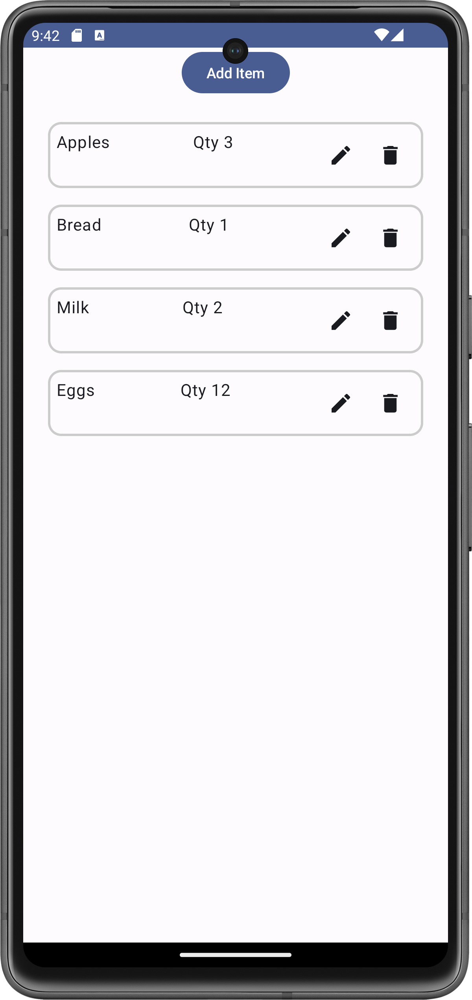
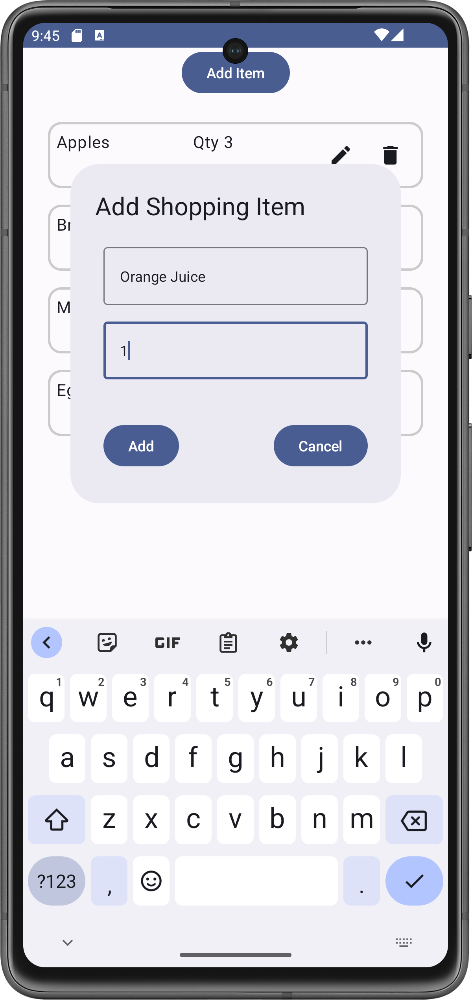
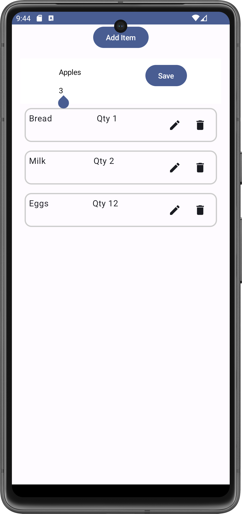

# MyShoppingListApp

## Overview

MyShoppingListApp is a simple shopping list application built using Jetpack Compose in Android. This app allows users to add, edit, and delete items from a shopping list. It demonstrates the use of various Compose components such as `LazyColumn`, `AlertDialog`, and `BasicTextField`, as well as Kotlin features like lambda expressions and the `copy` method.

## What I Learned
### Code Highlights

- **LazyColumn**: Used to display a scrolling list of items efficiently. `LazyColumn` only composes and lays out items that are visible on the screen, which helps in managing large lists.
  
  ```kotlin
  LazyColumn(
      modifier = Modifier
          .fillMaxSize()
          .padding(16.dp)
  ) {
      items(sItems) { item ->
          // Item content
      }
  }
  ```
  - **Alert Dialog**:
  A dialog that can be used to get user confirmation or input. Used here to add new items to the shopping list.
```kotlin
if (showDialog) {
    AlertDialog(
        onDismissRequest = { showDialog = false },
        confirmButton = {
            // Confirm Button
        },
        title = { Text(text = "Add Shopping Item") },
        text = {
            // Dialog content
        }
    )
}
 ```
- **List Item in LazyColumn**:
Each item in the list can be customized. ShoppingListItem is a composable that shows the item’s name and quantity, along with edit and delete buttons.
```kotlin
@Composable
fun ShoppingListItem(
    item: ShoppingItem,
    onEditClick: () -> Unit,
    onDeleteClick: () -> Unit
) {
    // List item layout
}
```
- **Lambda Expressions**:
Used to pass functions as parameters. For instance, onEditClick and onDeleteClick are lambda functions that are executed when the respective actions are triggered.
```kotlin
IconButton(onClick = onEditClick) {
    Icon(imageVector = Icons.Default.Edit, contentDescription = null)
}
```
- **Map Keyword**: The map function is used to transform lists. In this app, it is used to update items in the list when editing.
```kotlin
sItems = sItems.map { it.copy(isEditing = it.id == item.id) }
```
- **Copy Method**:The copy method is used to create a new instance of a data class with some properties modified. Useful for immutability.
 ```kotlin
val newItem = item.copy(name = editName, quantity = editQuantity)
```
- **Let and Nullable Types**: let is used to perform operations on a nullable object if it is not null. toIntOrNull() is used to safely parse a string to an integer.
```kotlin
editQuantity.toIntOrNull() ?: 1

```
## Steps to Run the App

1. **Clone the Repository**

   ```bash
   git clone https://github.com/yourusername/MyShoppingListApp.git
   ```
2. **Open the Project**
 Open Android Studio and select "Open an existing project". Navigate to the cloned repository and open it.
3. **Build and Run**

- **Sync Gradle**: Ensure all dependencies are downloaded.
  
- **Run the App**: 
  - Click the **"Run"** button in Android Studio.
  - Alternatively, use the shortcut **`Shift + F10`**.
## Screenshots *(Pixel 7 virtual device)*
<div align="center">

<!-- Main Screen -->

<p style="text-align:center;"><em>Main Screen with Shopping List.</em></p>

<!-- Dialog for adding items -->

<p style="text-align:center;"><em>Dialog for Adding Items</em></p>

<!-- Dialog for editing items -->

<p style="text-align:center;"><em>Dialog for Editing Items</em></p>

</div>
    
